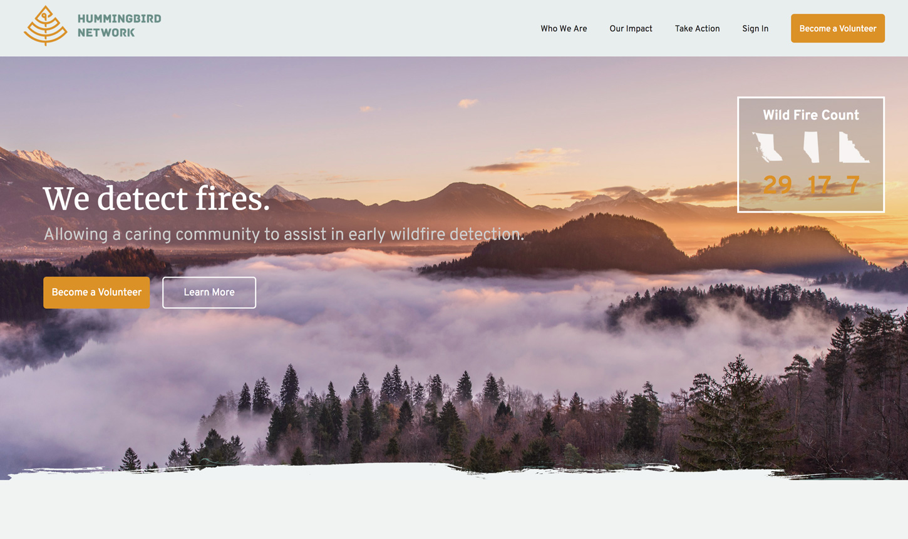

# Hummingbird Network 

A WordPress site designed and created for Hummingbird Network, an organization dedicated to the early warning of forest fires in western Canada. This site is intended to spread awareness and encourage potential volunteers to sign up and enhance their ability to have universal, immediate indication of forest fires throughout the western provinces. We have created a simple to use, attractive website used to spread awareness and encourage potential volunteers to sign up.

This project is part of Red Academy coursework.

## Code

This site is built using:
- Wordpress
- SASS
- CSS Grid and Flexbox
- PHP
- Javascript / jQuery

Development Environment:
- Gulp
- Git / Github

## Features

- A custom page template for each page
- Custom fields for easy client-side updating of page copy and images
- Multiple page-specific contact forms

## Credits

Design

- Jayson Postle
- Puja Prakash
- Nijhum
- Kajetan Maczkowski

Development

- Hamdy Farah
- Nathan Moseley
- Travis Rempel

* Based on Underscores http://underscores.me/, (C) 2012-2015 Automattic, Inc., [GPLv2 or later](https://www.gnu.org/licenses/gpl-2.0.html)
* normalize.css http://necolas.github.io/normalize.css/, (C) 2012-2015 Nicolas Gallagher and Jonathan Neal, see license.